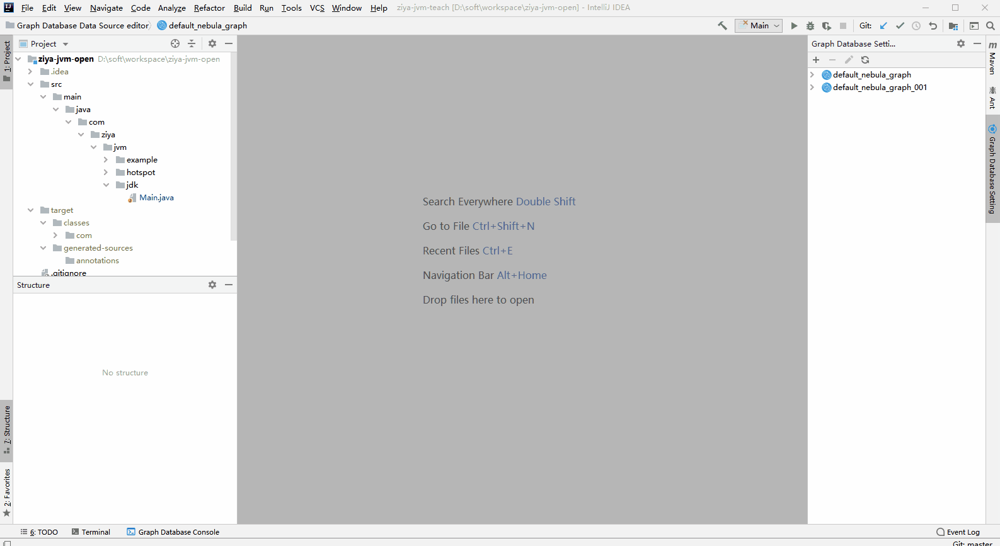

# [Nebula Graph Database support](https://github.com/awang12345/nebula-console-for-idea)
[](https://travis-ci.org/awang12345/nebula-console-for-idea)

## Plugin for [IntelliJ IDEA](http://plugins.jetbrains.com/plugin/6317-lombok-plugin) to support [Nebula-Console](https://docs.nebula-graph.com.cn/3.6.0/nebula-console/).
___
- Provides support for console to manage nebula data with IntelliJ IDEA.

Plugin is developed and supported by [awang12345](http://awang12345.github.io/).



This plugin is based on the
[Graph Database Support](https://github.com/neueda/jetbrains-plugin-graph-database-support)
plugin, originally developed by [Neueda Technologies](http://technologies.neueda.com/).
The original plugin has not been updated for a long time and does not work with Nebula.

## Features
___
- Works in **any** Jetbrains IDE
- Manage data sources
- Write and execute queries
- Explore query results in table view
- Explore query results in graph view
- Supported databases:
  - Neo4j 3.4+ (Bolt)
  - Nebula 3.0+ (Thrift)
- [nGQL](https://docs.nebula-graph.com.cn/3.6.0/3.ngql-guide/1.nGQL-overview/1.overview/) query language:
    - Understands queries in `.ngql` files
    - Syntax highlight
    - Autocompletion support for identifiers, keywords, functions, space, tag, edge, etc.
      [nebula-graph](https://www.nebula-graph.com.cn),
      [nebula-client](https://docs.nebula-graph.com.cn/3.6.0/14.client/4.nebula-java-client)
- [Cypher](https://github.com/opencypher/openCypher) query language:
  - Understands queries in `.cyp`, `.cypher` or `.cql` files
  - Syntax highlight and error reporting
  - Refactoring support for identifiers, labels, relationship types and properties
  - Autocompletion support for identifiers, labels, relationship types, properties, functions and stored procedures. Information gathered from existing queries and configured data sources
  - Code reformatting
  - Provide documentation for functions and stored procedures
  - Inspections: database warnings, function checks, type system. 

## How To Use
___
1. Install the plugin
   * Search "Nebula Graph" from the [Jetbrains Plugin Marketing](https://plugins.jetbrains.com/plugin/23470) .
   * Download the latest version of the plugin file from the [release](https://github.com/nebula-contrib/nebula-console-intellij-plugin/releases) and install it manually.
2. In the sidebar toolwindow of idea IDE find ""  menu
3. Click "+" button to add a graph database config and verify that the connection is valid.
4. Click "" button to refresh the database metadata.
5. Double-click the root node (datasource name) to open the graph sql editor panel.
6. Write your sql on editor panel and right click and choose Run.Or click "" button to run your sql.
7. The sql result show in the console panel below the editor panel.The **"log"** table show the execute log information.The **"table"** table show the result information.


## Supported Jetbrains Products
___
* IntelliJ Idea 2019.1+
* RubyMine
* WebStorm
* PhpStorm
* PyCharm
* AppCode
* Android Studio
* Datagrip
* CLion

## Development
___
Warning: Required to switch local environment to JDK 11.

Gradle is used as build system.

``` Build And Run
# Build plugin distribution
./gradlew buildPlugin

# Run idea in development mode
./gradlew :graph-database-support-plugin:runIde
```
